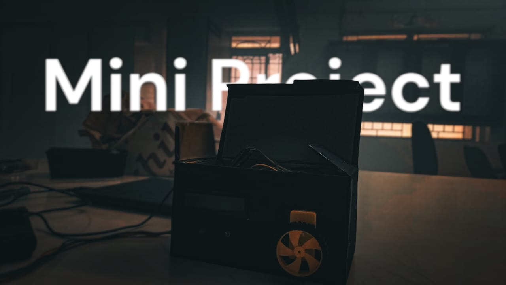

# Accident Preventor - Arduino Project

## Introduction:

Accident Preventor is an Arduino-based project designed to enhance road safety by addressing two critical factors: driver fatigue and alcohol consumption. The project utilizes an eye blink detector and an alcohol detection system integrated into a pair of glasses to monitor the driver's condition in real-time.

## Features:

1. **Detection:** The eye blink detector continuously monitors the driver's eyes, while the alcohol detection system samples the driver's breath for alcohol content.

2. **Alert:** Upon detecting prolonged eye closure or the presence of alcohol, the system alerts the driver using visual and auditory signals, ensuring immediate attention to potential danger.

3. **Automatic Motor Stop:** In cases where the driver fails to respond to warnings, the Arduino-based system can automatically halt the vehicle's motor, preventing the driver from operating the vehicle and mitigating the risk of accidents.

## Components:

- Arduino Uno
- IR Sensor for eye blink detection
- Gas sensor for alcohol detection
- Buzzer for auditory alerts
- LCD screen for visual alerts
- Relay module for motor control

## Circuit Diagram:

## How It Works:

1. The sensors continuously monitor the driver's condition.
2. If signs of fatigue or alcohol consumption are detected, the system triggers alerts.
3. If the driver fails to respond to warnings, the system automatically stops the vehicle's motor, ensuring safety.

## Hardware Layout:

<video width="640" height="360" controls>
    <source src="circuit video.mp4" type="video/mp4">
    Your browser does not support the video tag.
</video>

## Contributing:

Contributions to enhance the project's features, improve code efficiency, or address any issues are welcome. Fork the repository, make your changes, and submit a pull request for review.

## License:

This project is licensed under the [MIT License](link-to-license), allowing for modification and distribution under certain conditions. See the LICENSE file for details.

## Acknowledgments:

I would like to acknowledge the contributions of <a href="https://github.com/SHREYANSHSK">Shreyansh Khandelwal</a> in developing this project.

## Disclaimer:

This project is intended for educational purposes and should not be solely relied upon for road safety. Always prioritize safe driving practices and adhere to local traffic laws and regulations.
